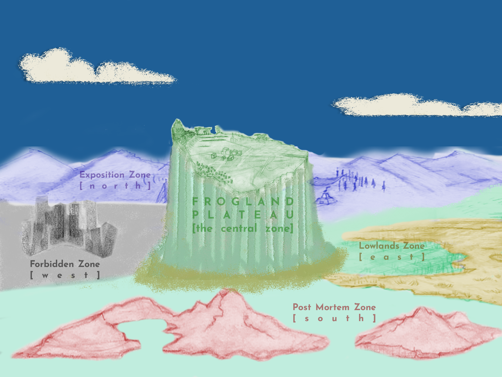

# Geografía y diseño

### Mapa de NewPangea

NewPangea es la metaverso global, compuesto por cinco zonas con características temáticas ligeramente diferentes.  Los proyectos asociados que se unen a NewPangea tienen su "distrito" en una zona específica, pero será posible viajar entre las zonas. Los individuos pueden comprar terrenos en el distrito perteneciente a su proyecto, pero estamos explorando tanto la opción de comprar terreno en cualquier distrito, como la opción de que un propietario de terreno alquile el espacio.&#x20;

## Las Cinco zonas de NewPangea

### La Zona Central

#### La Meseta

* A diferencia de las zonas circundantes, la meseta central contiene sólo un distrito: Frogland. Esa limitación tiene tres objetivos:
  * Proporciona a los propietarios de Notorious Frogs la distinción de ser fundadores de este metaverso
  * Proporciona una base para el desarrollo de narrativas detalladas con otros proyectos.  La centralidad de Frogland la sitúa en una posición de poder potencial dentro de el metaverso, lo que puede significar que se convertirá en una amenaza, y puede significar que se convertirá en un objetivo de toma de control.
  * La centralidad también ayudará al desarrollo de sistemas económicos tanto en el juego como en el mundo real.  Frogland será un campo de pruebas de valor de tokens y utilidad, y su experiencia en esas áreas informará a otros proyectos sobre lo que funciona, qué no, y qué oportunidades pueden ser cubiertas por la cultura y la economía que traen al metaverso. &#x20;
* Frogland tendrá vecinos definidos por hábitat y función. Por ejemplo, hay una calle principal, "Amphibian Way", un centro de ciudad, además habrá áreas subsidiarias que tendrán su propio sabor de negocios. como la "Luz Verde" (Green Light) de Frogland, un área arcana "Frog Worts", y las afueras conocidas como la "Frontera" (Borderlands).  Habrá estanques, unos más pequeños, otros más grandes, la mayoría de ellos principalmente áreas residenciales, pero otros podrían desarrollarse como áreas recreacionales o industriales. Algunas de las tierras están reservadas para los negocios, incluyendo la agricultura y la fabricación.
* Frogland tiene mucha agua fresca, pero la cascada de agua sobre sus bordes transporta los nutrientes del suelo que limitan el tipo de plantas que pueden crecer allí. Algunas de estas plantas han desarrollado sistemas de raices agresivos que lentamente estrangulan rocas volcánicas subsuperficiales para extraer nutrientes. Existen al menos dos especies de plantas que han desarrollado la capacidad de comer grandes insectos y pequeños animales para alimentar sus necesidades.
* Frogland también tiene áreas de denso bosque tropical. Escondidos en las profundidades de estos bosques se encuentran ruinas de origen desconocido.
* El descubrimiento de amplios túneles sinuosos bajo la superficie conducen a la teoría de que los pasajes subterráneos pueden haber sido fumarolas de un volcán ya extinto. Sin embargo, otras explicaciones son posibles. Un grupo de Ranas cree que son el hogar de una especie subterránea extinguida, o posiblemente una que ha migrado subterráneamente y que ahora habita la superficie debajo de una o más del vasto territorio de las zonas circundantes. Una rana en particular, quien ha optado por vivir en los túneles y que sólo emerge en la superficie por la noche afirma que hay petroglifos en las paredes de algunos túneles. y que los dibujos en las paredes representan una criatura que ninguna Rana ha visto jamás.

## Las otras 4 zonas que rodean la meseta de Frogland

### La Zona Prohibida

* Al oeste de la Meseta de Frogland
* El tema general es "Tierras Lejanas y Tierra Salvaje" (nótese que 'tierra salvaje' no es solo bosque - los desiertos son 'salvajes', al igual que la 'tundra'.
* La Ciudad en Ruinas es una ciudad que puede tener varios distritos.
* "Gutterville" es el distrito principal de Gutter Cat Gang

### La Zona Post-Mortem

* Al sur de la meseta de Frogland
* El tema general es "El Otromundo" es decir, la ultratumba
* La isla de Osseous –el distrito de origen de los no-muertos Wicked Craniums es un ejemplo de una ciudad que sólo pretende tener un distrito– la presunción es que los Craniums quieren la isla para sí mismos.

### La Zona de tierras bajas

* Al este de la meseta de Frogland
* El tema general es "Lodo e Inundación - Lagos y Arrollos"
* No poblado aún
* Un Distrito de los Pantanos está reservado para algunos de nuestros primates superiores favoritos por ahora.
* La Ciudad de Black Water (provisional)

### Zona de Exposición

* Al norte de la meseta de Frogland
* El tema general es: "un laboratorio/playground/taller para el futuro creativo del mundo"
* Sus distritos difieren de los distritos de coleccionables NFT de maneras únicas
* Los distritos están ambientados por espacios creativos y galerías, espacios de performance, escenarios&#x20;
